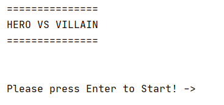
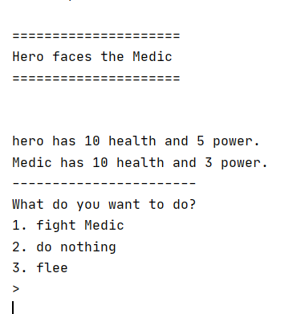
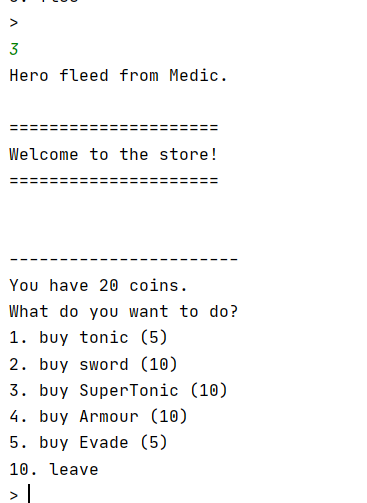

# Hero vs Villain (Mod)
#### DISCLAIMER: Original source code is from another GitHub user, tarekbeb. Check out his works at https://github.com/tarekbeb/ .
#### (Description taken from the original post, credits to tarekbeb)

A simple command line role playing game written in python using Object Oriented Programming concepts.

#### Getting Started
In order to run the game you need [Python 3](https://www.python.org/ftp/python/3.7.4/python-3.7.4-macosx10.9.pkg) installed. 

The game randomly generates villains and gives the player options as what to do.
You will get a chance to fight the villian, or stand by, or flee the fight.
Press the number of the option then enter to choose that option

Fleeing takes you to the store where you can buy items to restore or increase your power, increase your armor, 
or attacking powers.

#### Built With Python 3

## My modification:
- Startup Screen.
  - 

- Enemy randomizer.
  - 

- Adjustment in timings and spacings of text pop-ups.
  - 
