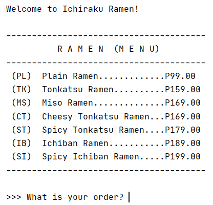
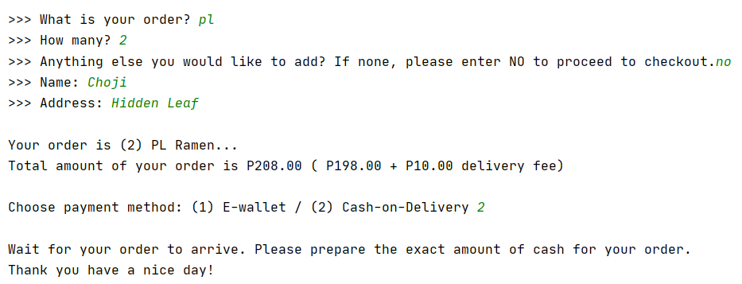
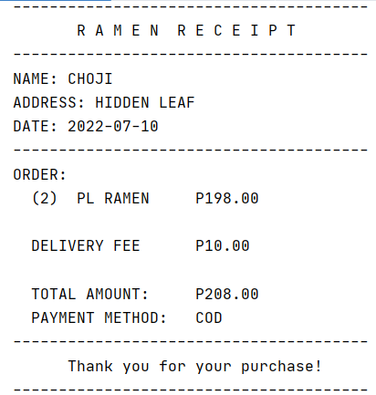

# Ichiraku Ramen Ordering System (Mod of order_ramen)

#### DISCLAIMER: Original Source Code is not mine. I can't find the name of the developer or even the original post itself. This project was used for academic compliance only.

(Credits to the owner)

A simple command-line ordering system program coded in Python.

In order to run this app, you need [Python 3](https://www.python.org/ftp/python/) installed. 

#### Features:
- Menu with different types of ramen that could be ordered.
  - 

- Take-in customer information and compute amount of order.
  - 

- Printing receipt of successful order.
  - 

## My modification:
- Welcome message and adjustment in timings of text pop-ups.
- Function to add any ramen to the order a number of times (instead of just one originally), and to the printed 'receipt' as well.
