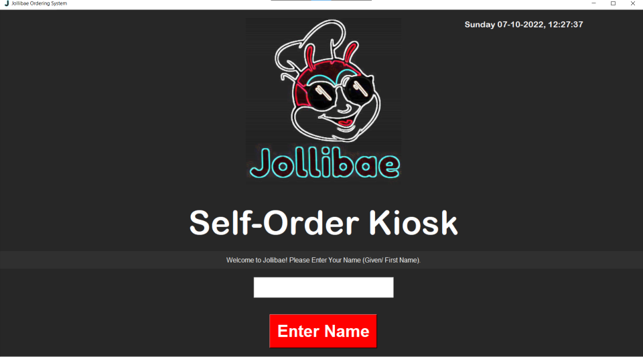
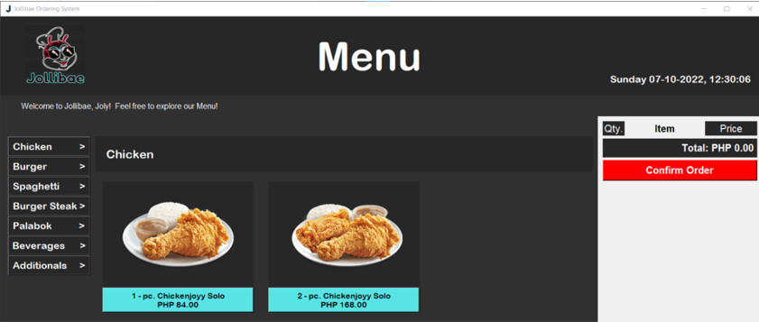
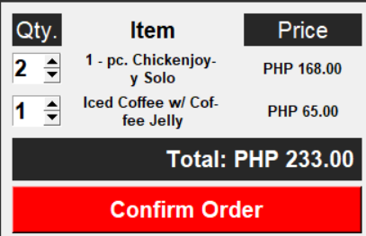
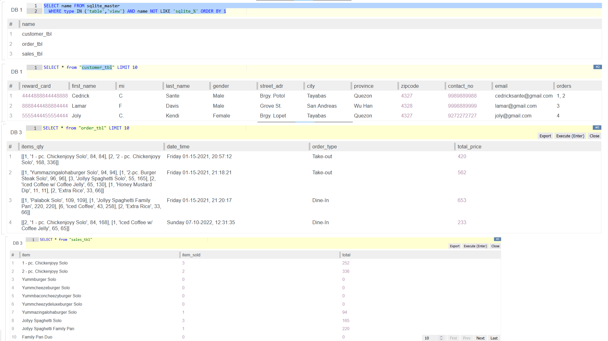
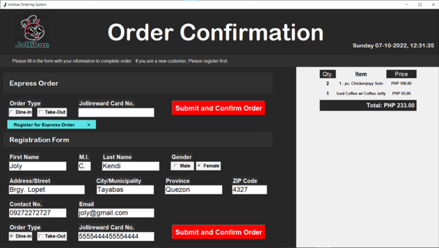

# Jollibae Ordering System
#### DISCLAIMER: The images and assets that are used and modified for this program are owned by Jollibee Foods Corporation. This project was used only for academic requirement.
   

A simple ordering system program coded in Python, with Tkinter GUI, and SQLite database integration.

In order to run this app, you need [Python 3](https://www.python.org/ftp/python/) installed. 

#### Features:
- Menu with tabs separating types of foods that could be ordered.
  - 

- Calculator for current amount of order with Real-time updating function.
  - 

- Saving of order history in database file, including Loyalty reward system with register/sign-up form, which could be based on 'Reward Card'.
  - 
  - 
